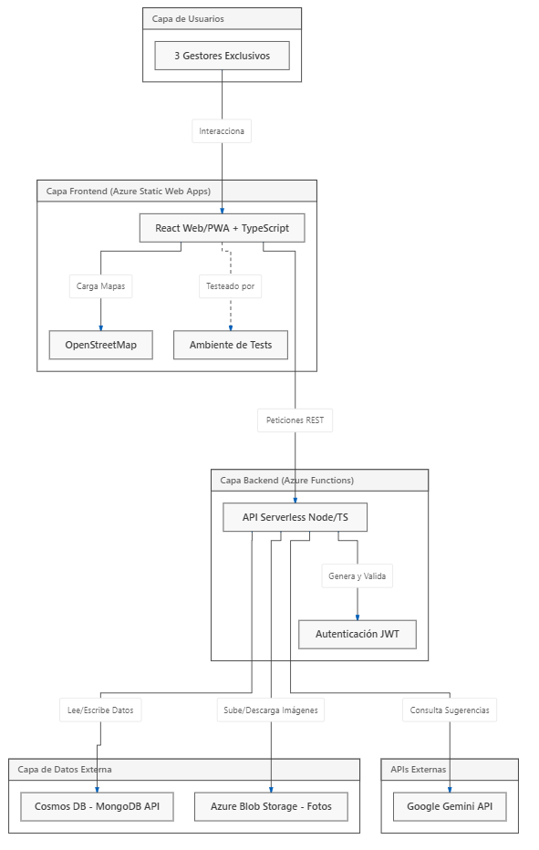

# Web App de Ministración

## 1. Propósito y Objetivos
**Web App de Ministración** es una aplicación diseñada para gestionar, organizar y dar seguimiento a los esfuerzos de ministración (visitas, atención y cuidado de miembros). 
Se enfoca en proporcionar una herramienta centralizada y exclusiva para **3 gestores administradores**. Todo está diseñado bajo un enfoque **Mobile-First moderno** (PWA y Desktop Web), buscando una experiencia de usuario rápida, fluida y sumamente visual.

**Objetivos clave:**
- Trackear visitas y organizar directorios.
- Controlar zonas geográficas a través de mapas interactivos.
- Monitorear métricas vitales (familias visitadas, atenciones urgentes, etc.).
- Agilizar la asignación de familias a ministrantes mediante inteligencia artificial (Fase 2).

---

## 2. Stack Tecnológico (Ecosistema Microsoft Azure)
El proyecto está construido íntegramente sobre un ecosistema de **Microsoft Azure** (aprovechando sus capas "Always Free" donde sea posible) y tecnologías web modernas.

- **Frontend (PWA y Web App):** React inicializado con Vite y **TypeScript**.
- **Estilos y UI:** Tailwind CSS, enfocado en un Design System premium, vibrante y con soporte para Dark Mode, micro-interacciones y diseño "glassmorphism".
- **Backend Custom (API Serverless):** Desarrollado con **Azure Functions** (Node.js y TypeScript).
- **Base de Datos:** **Azure Cosmos DB** (Usando la API compatible con MongoDB).
- **Almacenamiento de Archivos:** **Azure Blob Storage** (Para almacenar de forma segura las fotografías de las familias/usuarios).
- **Hosting Frontend:** **Azure Static Web Apps**.
- **Autenticación:** Sistema propio utilizando **JWT** y Bcrypt, con flujo completo de recuperación de contraseñas.
- **Mapas y Geolocalización:** Leaflet.js + OpenStreetMap.
- **Asistente IA (Fase 2):** Google Gemini API.

---

## 3. Sistema de Testing
- **Pruebas Unitarias y de Componentes:** **Vitest** en combinación con **React Testing Library**.

---

## 4. Arquitectura y Diagrama del Sistema

El sistema se divide en cuatro capas principales: una capa de Frontend alojada estáticamente que se comunica con una API Serverless. Dicha API maneja la autenticación y conecta tanto con la base de datos (Cosmos DB) como con el Storage y servicios de Inteligencia Artificial de terceros.

*Para una vista profunda de las relaciones de infraestructura, el diagrama superior muestra cómo el administrador interactúa con la ReactApp, que a su vez se apoya en Azure Functions para cualquier solicitud externa de datos, mapas o autenticación.*

---

## 5. Backlog y Fases de Desarrollo (Agile)

### Hecho (Done)
- **[Epic 0]** Diseño de las pantallas
- **[Epic 0]** Diseño del diagrama

### En proceso (In Progress)
- Configurar cuentas y stack

### Backlog
- **[Epic 1]** Pantalla "Resumen General" (NUEVO HOME) - dashboard
- **[Epic 1]** Tablero de Compañerismos (Lista)
- **[Epic 1]** Vista de Detalle del Compañerismo
- **[Epic 1]** Vista de Formación
- **[Epic 2]** Desarrollo API (Azure Functions + Cosmos DB + Blob Storage)
- **[Epic 2]** Panel y Formulario de Creación de Usuarios/Familias
- **[Epic 3]** Sistema Login (JWT y Bcrypt)
- **[Epic 3]** [NUEVO] Flujo de Recuperación de Contraseña
- **[Epic 4]** Mapa interactivo con División de Zonas *(Nota: Ya existe un prototipo funcional en `C:/Users/dan-b/Documents/igreja/quoum/cuadro_ministracion/index.html` que incluye Leaflet, Geoman y drag-and-drop. Se integrará y refactorizará a React/Tailwind en esta fase).*
- **[Epic 4]** Asignación de Coordenadas (Manual y Mapa)
- **[Epic 4]** Panel de Analítica Global
- **[Epic 5]** Configurar Vitest y pruebas unitarias
- **[Epic 6]** Sugerencias de Asignación con IA (Gemini)
- **PRUEBAS FINALES**
- **PRODUCCION**

---

## 6. Diseños de Pantalla (Diseños Premium)

A continuación se presentan los mockups oficiales de la aplicación (enfoque Mobile-First). Todos los diseños buscan proveer una experiencia visual atractiva y fluida.

| Pantalla | Descripción e Imagen |
|----------|----------------------|
| **01 Login** | Flujo de entrada de los gestores. .png) |
| **02 Layout Base** | Estructura general de navegación de la App.  |
| **03 Dashboard** | Pantalla principal "Resumen General" con métricas.  |
| **04 Formación** | Organigrama visual interactivo de los compañeros.  |
| **05 Detalle Checklist** | Vista profunda para verificar atenciones e hitos.  |
| **06 Gestión CRUD** | Panel general de Directorio y Tableros.  |
| **07 Formulario** | Inserción de nuevas familias, control de miembros y fotos.  |
| **08 Mapa y Zonas** | Visualización interactiva Leaflet + OpenStreetMap.  |
| **09 Analítica** | Gráficos y reportes de estado del servicio.  |
| **10 Asistente IA** | Chat de sugerencias y soporte basado en Gemini API. .png) |
